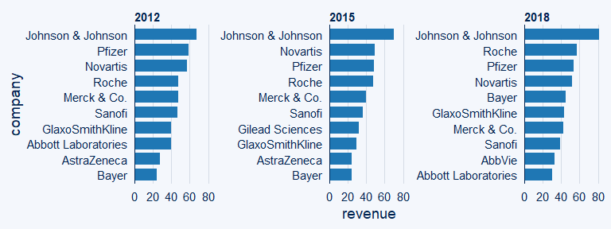
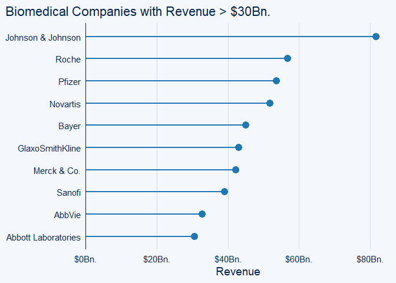
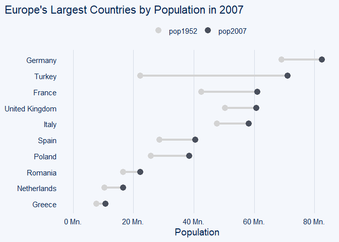
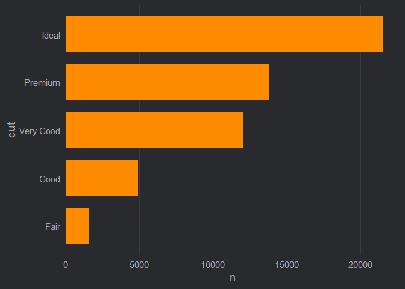
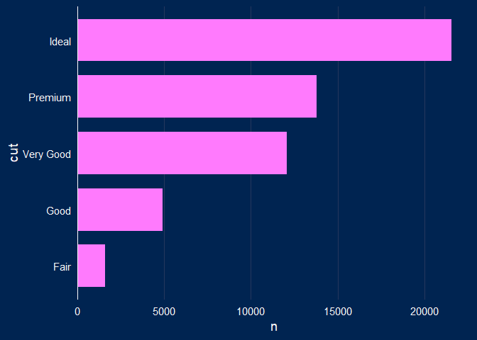

# ggcharts 

[](https://github.com/thomas-neitmann/ggcharts/actions)
[](https://cran.r-project.org/package=ggcharts)
[](https://cran.r-project.org/package=ggcharts)
[](https://www.tidyverse.org/lifecycle/#experimental)

## Overview

`{ggcharts}` provides a high-level `{ggplot2}` interface for creating
common charts. Its aim is both simple and ambitious: to get you from
your data visualization idea to an actual plot faster. How so? By taking
care of a lot of data preprocessing, obscure `{ggplot2}` details and
plot styling for you. The resulting plots are `ggplot` objects and can
be further customized using any `{ggplot2}` function.

## Installation

The package is available from CRAN.

``` r
install.packages("ggcharts")
```

Alternatively, you can install the latest development version from
GitHub.

``` r
if (!"remotes" %in% installed.packages()) {
  install.packages("remotes")
}
remotes::install_github("thomas-neitmann/ggcharts", upgrade = "never")
```

If you get an error when trying to install from GitHub, run this code
and then try to install once again.

``` r
Sys.setenv(R_REMOTES_NO_ERRORS_FROM_WARNINGS = "true")
```

If the installation still fails please open an
[issue](https://github.com/thomas-neitmann/ggcharts/issues).

## Why ggcharts?

Thanks to `{ggplot2}` you can create beautiful plots in `R`. However, it
can often take quite a bit of effort to get from a data visualization
idea to an actual plot. As an example, let’s say you want to create a
faceted bar chart displaying the top 10 within each facet ordered from
highest to lowest. What sounds simple is actually pretty hard to
achieve. Have a look:

``` r
library(dplyr)
library(ggplot2)
library(ggcharts)
data("biomedicalrevenue")

biomedicalrevenue %>%
  filter(year %in% c(2012, 2015, 2018)) %>%
  group_by(year) %>%
  top_n(10, revenue) %>%
  ungroup() %>%
  mutate(company = tidytext::reorder_within(company, revenue, year)) %>%
  ggplot(aes(company, revenue)) +
  geom_col() +
  coord_flip() +
  tidytext::scale_x_reordered() +
  facet_wrap(vars(year), scales = "free_y")
```


That’s a lot of code\! And you likely never heard of some of the
functions involved. With `{ggcharts}` you can create the same plot
(actually an even better looking one) in almost a single line of code.

``` r
biomedicalrevenue %>%
  filter(year %in% c(2012, 2015, 2018)) %>%
  bar_chart(x = company, y = revenue, facet = year, top_n = 10)
```



## Gallery

### Charts

``` r
data("revenue_wide")
line_chart(data = revenue_wide, x = year, y = Roche:Bayer) +
  labs(x = "Year", y = "Revenue (Billion USD)")
```

<!-- -->

``` r
biomedicalrevenue %>%
  filter(year == 2018) %>%
  lollipop_chart(x = company, y = revenue, threshold = 30) +
  labs(
    x = NULL,
    y = "Revenue",
    title = "Biomedical Companies with Revenue > $30Bn."
  ) +
  scale_y_continuous(
    labels = function(x) paste0("$", x, "Bn."),
    expand = expansion(mult = c(0, .05))
  )
```

<!-- -->

``` r
data("popeurope")
dumbbell_chart(
  data = popeurope,
  x = country,
  y1 = pop1952,
  y2 = pop2007,
  top_n = 10,
  point_colors = c("lightgray", "#494F5C")
) +
  labs(
    x = NULL,
    y = "Population",
    title = "Europe's Largest Countries by Population in 2007"
  ) +
  scale_y_continuous(
    limits = c(0, NA),
    labels = function(x) paste(x, "Mn.")
  )
```

<!-- -->

``` r
data(mtcars)
mtcars_z <- dplyr::transmute(
  .data = mtcars,
  model = row.names(mtcars),
  hpz = scale(hp)
)

diverging_bar_chart(data = mtcars_z, x = model, y = hpz)
```

<!-- -->

``` r
diverging_lollipop_chart(
  data = mtcars_z,
  x = model,
  y = hpz,
  lollipop_colors = c("#006400", "#b32134"),
  text_color = c("#006400", "#b32134")
)
```

<!-- -->

``` r
data("popch")
pyramid_chart(data = popch, x = age, y = pop, group = sex)
```

<!-- -->

### Themes

``` r
ggcharts_set_theme("theme_hermit")
bar_chart(data = diamonds, x = cut)
```

<!-- -->

``` r
ggcharts_set_theme("theme_ng")
bar_chart(data = diamonds, x = cut)
```

<!-- -->

``` r
ggcharts_set_theme("theme_nightblue")
bar_chart(data = diamonds, x = cut)
```

<!-- -->
