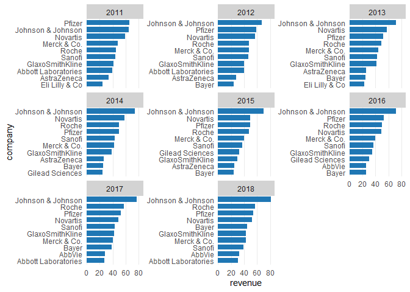
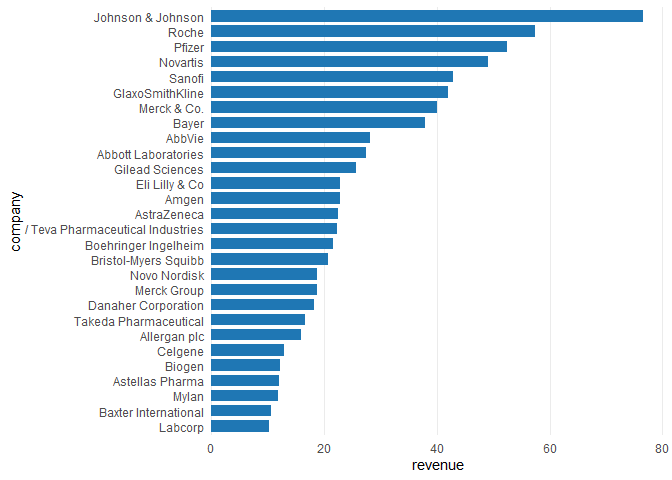
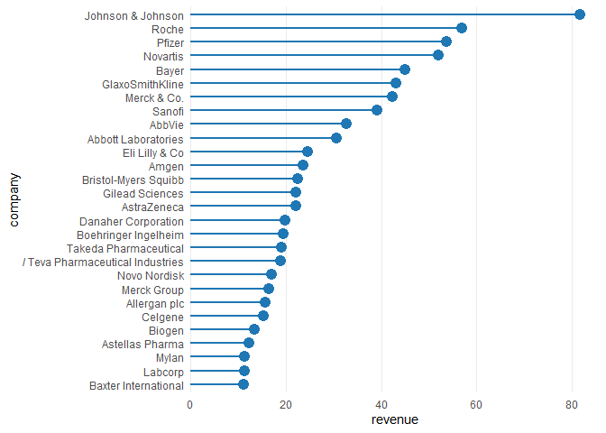
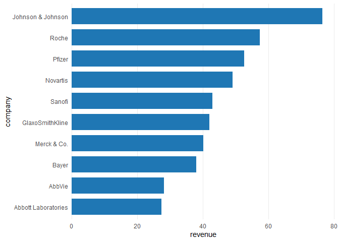
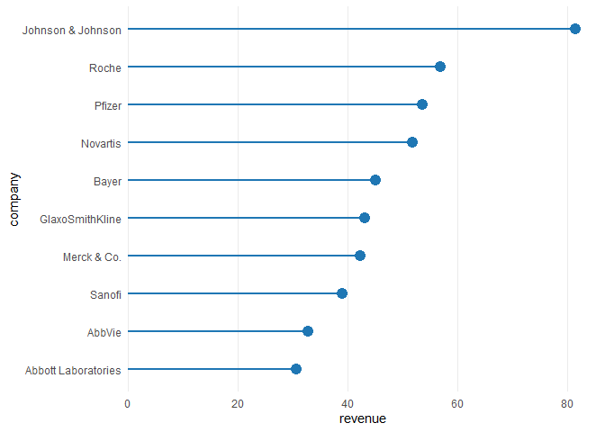
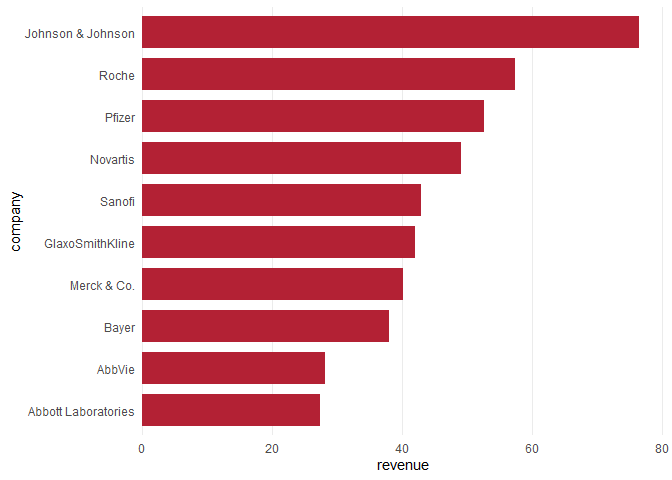
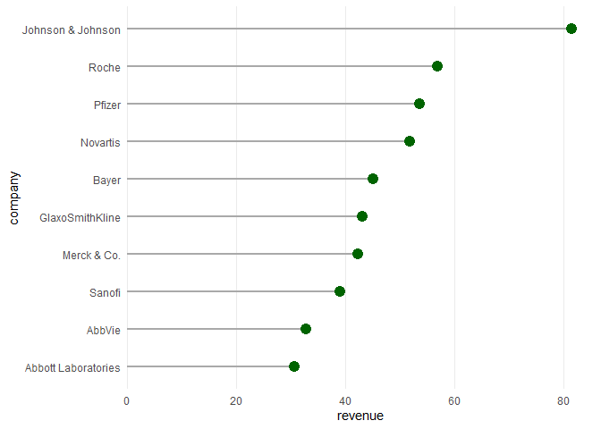
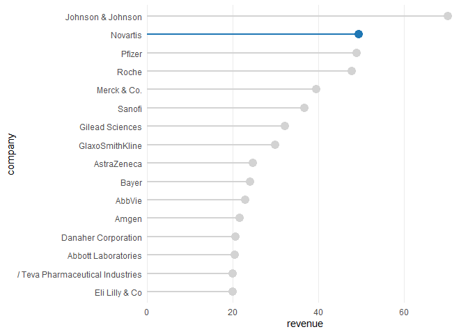
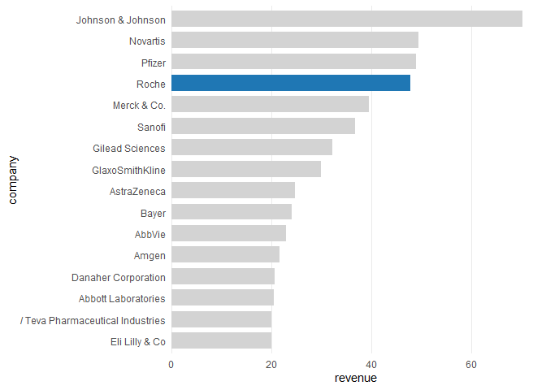
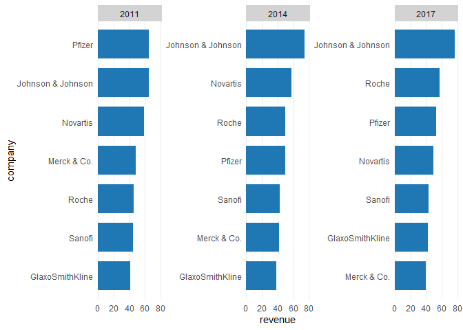

ggcharts
================

[](https://travis-ci.com/thomas-neitmann/ggcharts)

Installation
------------

``` r
if (!"remotes" %in% installed.packages()) {
  install.packages("remotes")
}
remotes::install_github("thomas-neitmann/ggcharts")
```

Why ggcharts?
-------------

Thanks to ggplot2 you can create beautiful plots in R. However, it can often take quite a bit of effort to get from a data visualization idea to an actual plot. As an example, let's say you want to create a faceted bar chart displaying the top 10 within each facet ordered from highest to lowest. What sounds simple is actually pretty hard to achieve. Have a look:

``` r
library(dplyr)
```

    ## Warning: package 'dplyr' was built under R version 3.6.3

``` r
library(ggplot2)
library(ggcharts)
data("biomedicalrevenue")

biomedicalrevenue %>%
  group_by(year) %>%
  top_n(10, revenue) %>%
  ungroup() %>%
  mutate(company = tidytext::reorder_within(company, revenue, year)) %>%
  ggplot(aes(company, revenue)) +
  geom_col() +
  coord_flip() +
  tidytext::scale_x_reordered() +
  facet_wrap(vars(year), scales = "free_y")
```


That's a lot of code! And you likely never heard of some of the functions involved. With ggcharts you can create the same plot (actually an even better looking one) in a single line of code.

``` r
bar_chart(biomedicalrevenue, company, revenue, facet = year, limit = 10)
```



That's the beauty of ggcharts: shortening the distance between data visualization idea and actual plot as much as possible.

Usage
-----

### Basics

Let's start off by loading some data for plotting. `ggcharts` comes with the `biomedicalrevenue` dataset which contains annual revenues (in billion USD) of top biomedical companies from 2011 to 2018.

``` r
head(biomedicalrevenue, 10)
```

    ##              company year revenue
    ## 1  Johnson & Johnson 2018   81.60
    ## 2  Johnson & Johnson 2017   76.50
    ## 3  Johnson & Johnson 2016   71.89
    ## 4  Johnson & Johnson 2015   70.10
    ## 5  Johnson & Johnson 2014   74.30
    ## 6  Johnson & Johnson 2013   71.31
    ## 7  Johnson & Johnson 2012   67.20
    ## 8  Johnson & Johnson 2011   65.00
    ## 9              Roche 2018   56.86
    ## 10             Roche 2017   57.37

Now that we have our data let's create a basic `bar_chart()` and `lollipop_chart()`.

``` r
biomedicalrevenue %>%
  filter(year == 2017) %>%
  bar_chart(company, revenue)

biomedicalrevenue %>%
  filter(year == 2018) %>%
  lollipop_chart(company, revenue)
```



From this little example you can already see some important features of `ggcharts`:

-   the data is sorted prior to plotting without you having to take care of that; if that is not desireable set `sort = FALSE`
-   the plot is horizontal by default; this can be changed by setting `horizontal = FALSE`
-   `ggcharts` uses `theme_minimal()`

### Using the limit argument

The plots above contain data from all companies. What if you want to display only the top 10? That's easy, just set `limit = 10`.

``` r
biomedicalrevenue %>%
  filter(year == 2017) %>%
  bar_chart(company, revenue, limit = 10)

biomedicalrevenue %>%
  filter(year == 2018) %>%
  lollipop_chart(company, revenue, limit = 10)
```



### Changing colors

``` r
biomedicalrevenue %>%
  filter(year == 2017) %>%
  bar_chart(company, revenue, bar_color = "#b32134", limit = 10)

biomedicalrevenue %>%
  filter(year == 2018) %>%
  lollipop_chart(
    company, revenue, 
    point_color = "darkgreen", line_color = "darkgray", 
    limit = 10
  )
```



### Highlighting

``` r
biomedicalrevenue %>%
  filter(year == 2015) %>%
  lollipop_chart(company, revenue, highlight = "Novartis", limit = 15)

biomedicalrevenue %>%
  filter(year == 2015) %>%
  bar_chart(company, revenue, highlight = "Roche", limit = 15)
```



### Facetting

``` r
biomedicalrevenue %>%
  filter(year %in% c(2011, 2014, 2017)) %>%
  bar_chart(company, revenue, facet = year, limit = 7)
```


