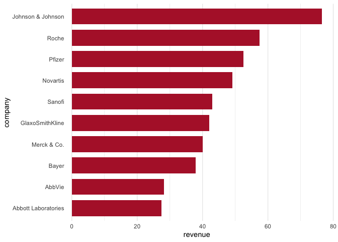
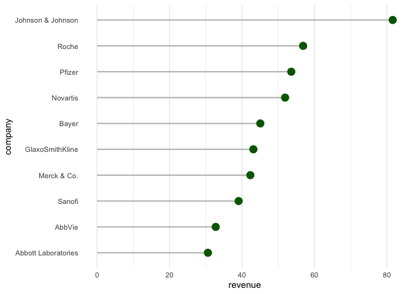
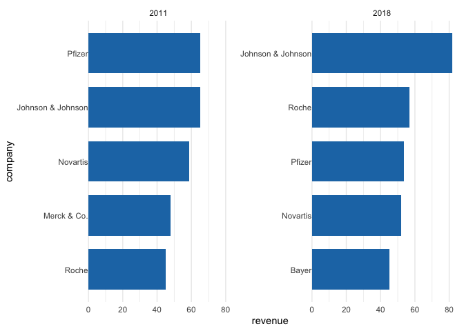

Installation
============

    if (!"remotes" %in% installed.packages()) {
      install.packages("remotes")
    }
    remotes::install_github("thomas-neitmann/ggcharts")

Usage
=====

Basics
------

Let’s start off by loading some data for plotting. `ggcharts` comes with
the `biomedicalrevenue` dataset which contains annual revenues (in
billion USD) of top biomedical companies from 2011 to 2018.

    library(dplyr)
    library(ggcharts)
    data("biomedicalrevenue")
    head(biomedicalrevenue, 10)

    ##              company year revenue
    ## 1  Johnson & Johnson 2018   81.60
    ## 2  Johnson & Johnson 2017   76.50
    ## 3  Johnson & Johnson 2016   71.89
    ## 4  Johnson & Johnson 2015   70.10
    ## 5  Johnson & Johnson 2014   74.30
    ## 6  Johnson & Johnson 2013   71.31
    ## 7  Johnson & Johnson 2012   67.20
    ## 8  Johnson & Johnson 2011   65.00
    ## 9              Roche 2018   56.86
    ## 10             Roche 2017   57.37

Now that we have our data let’s create a basic `bar_chart()` and
`lollipop_chart()`.

    biomedicalrevenue %>%
      filter(year == 2017) %>%
      bar_chart(company, revenue)

    biomedicalrevenue %>%
      filter(year == 2018) %>%
      lollipop_chart(company, revenue)

From this little example you can already see some important features of
`ggcharts`:

-   the data is sorted prior to plotting without you having to take care
    of that; if that is not desireable set `sort = FALSE`
-   the plot is horizontal by default; this can be changed by setting
    `horizontal = FALSE`
-   `ggcharts` uses `theme_minimal()`

Using the limit argument
------------------------

The plots above contain data from all companies. What if you want to
display only the top 10? That’s easy, just set `limit = 10`.

    biomedicalrevenue %>%
      filter(year == 2017) %>%
      bar_chart(company, revenue, limit = 10)

    biomedicalrevenue %>%
      filter(year == 2018) %>%
      lollipop_chart(company, revenue, limit = 10)

Changing colors
---------------

    biomedicalrevenue %>%
      filter(year == 2017) %>%
      bar_chart(company, revenue, bar_color = "#b32134", limit = 10)

    biomedicalrevenue %>%
      filter(year == 2018) %>%
      lollipop_chart(
        company, revenue, 
        point_color = "darkgreen", line_color = "gray", 
        limit = 10
      )

Facetting
---------

    biomedicalrevenue %>%
      filter(year %in% c(2011, 2018)) %>%
      bar_chart(company, revenue, year, limit = 5)

